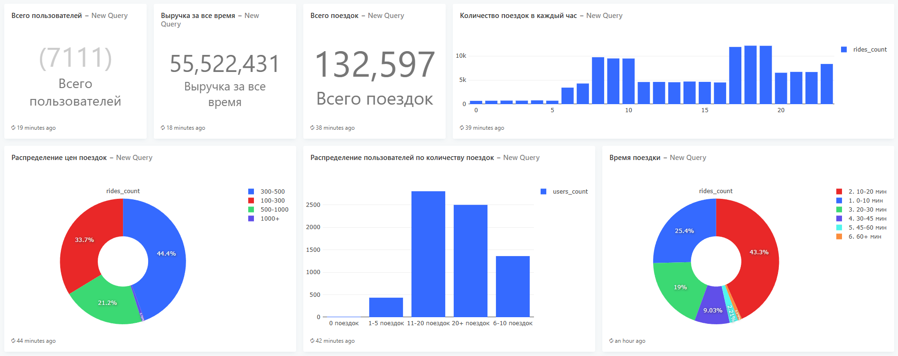
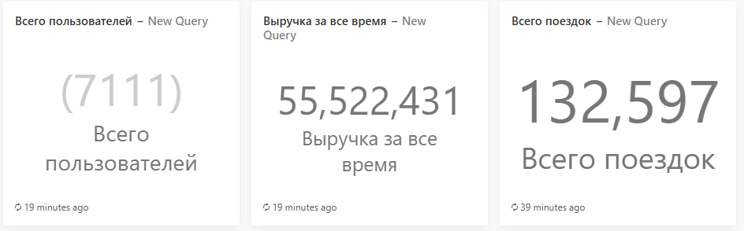
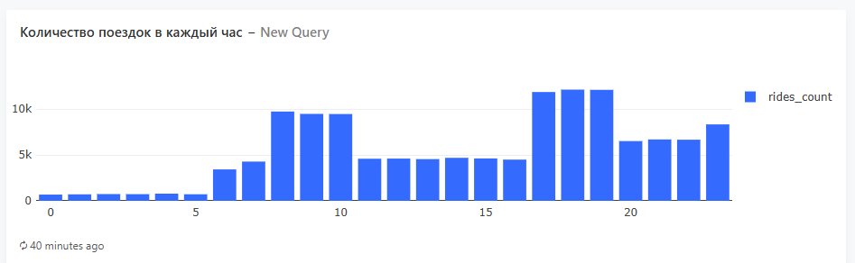
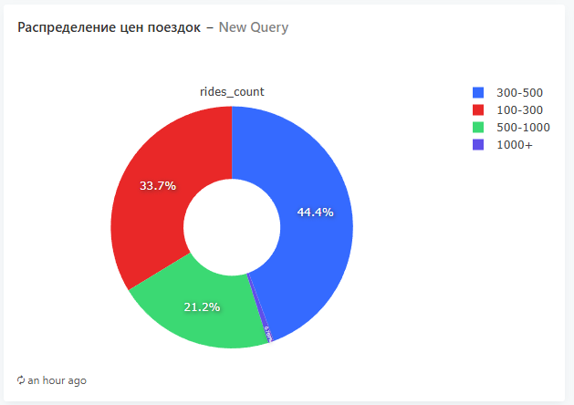
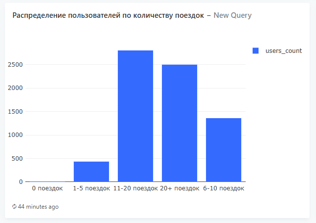
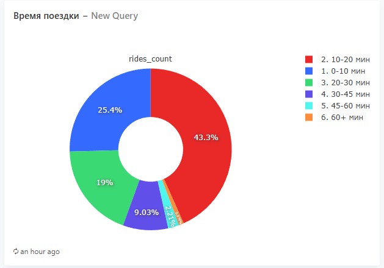

# Taxi Analytics

Система аналитики такси-сервиса с генерацией данных, хранением в PostgreSQL и визуализацией в Redash.

## Описание

Проект включает:
- **Генератор данных** — Python-приложение для создания тестовых данных о поездках
- **PostgreSQL** — база данных для хранения информации о пользователях, водителях и поездках
- **Redash** — инструмент для визуализации и анализа данных


## Пример дашборда


### Общая информация



### Распределение поездок по времени суток



### Распределение цен поездок



### Распределение пользователей по количеству поездок



### Распределение среднего времени поездок



## Быстрый старт


### Требования

- Docker Desktop
- Docker Compose

### Запуск

1. **Клонируйте репозиторий**
   ```bash
   git clone https://github.com/pavel-zah/TaxiAnalysis
   cd taxi-analytics
   ```

2. **Запустите проект**
   ```bash
   docker-compose up -d
   ```

3. **Дождитесь запуска всех сервисов**
   ```bash
   docker-compose ps
   ```

4. **Откройте Redash**
   - URL: http://localhost:5000
   - Создайте admin-пользователя при первом входе

### Настройка Redash

1. Перейдите в **Settings** → **Data Sources**
2. Нажмите **New Data Source**
3. Выберите **PostgreSQL**
4. Укажите параметры:

   | Параметр | Значение    |
      |----------|-------------|
      | Name | Taxi DB     |
      | Host | postgres    |
      | Port | 5432        |
      | Database | taxi        |
      | User | user        |
      | Password | password123 |
5. Нажмите **Test Connection** → **Save**

## Структура базы данных

### Таблица `users`
| Поле | Тип | Описание |
|------|-----|----------|
| id | VARCHAR(255) | Уникальный идентификатор |
| username | VARCHAR(255) | Имя пользователя |
| register_date | TIMESTAMP | Дата регистрации |

### Таблица `drivers`
| Поле | Тип | Описание |
|------|-----|----------|
| id | VARCHAR(255) | Уникальный идентификатор |
| username | VARCHAR(255) | Имя водителя |
| license_plate | VARCHAR(50) | Номер автомобиля |
| register_date | TIMESTAMP | Дата регистрации |

### Таблица `rides`
| Поле | Тип | Описание |
|------|-----|----------|
| id | VARCHAR(255) | Уникальный идентификатор |
| driver_id | VARCHAR(255) | ID водителя |
| rider_id | VARCHAR(255) | ID пассажира |
| starting_point | VARCHAR(255) | Точка отправления |
| destination | VARCHAR(255) | Точка назначения |
| started_at | TIMESTAMP | Время начала |
| ended_at | TIMESTAMP | Время окончания |
| price | DECIMAL(10,2) | Стоимость поездки |
| tip | DECIMAL(10,2) | Чаевые |

## Примеры SQL-запросов для Redash

### Общая статистика
```sql
SELECT 
    COUNT(*) as total_rides,
    SUM(price) as total_revenue,
    ROUND(AVG(price), 2) as avg_price
FROM rides;
```

### Поездки по дням
```sql
SELECT 
    DATE(started_at) as date,
    COUNT(*) as rides_count,
    SUM(price) as revenue
FROM rides
GROUP BY DATE(started_at)
ORDER BY date;
```

### Распределение по времени поездки
```sql
SELECT 
    CASE 
        WHEN EXTRACT(EPOCH FROM (ended_at - started_at)) / 60 < 10 THEN '0-10 мин'
        WHEN EXTRACT(EPOCH FROM (ended_at - started_at)) / 60 < 20 THEN '10-20 мин'
        WHEN EXTRACT(EPOCH FROM (ended_at - started_at)) / 60 < 30 THEN '20-30 мин'
        ELSE '30+ мин'
    END AS duration_range,
    COUNT(*) AS rides_count
FROM rides
WHERE ended_at IS NOT NULL
GROUP BY duration_range;
```


## Команды

### Управление контейнерами
```bash
# Запуск
docker-compose up -d

# Остановка
docker-compose down

# Просмотр логов
docker-compose logs -f

# Перезапуск
docker-compose restart

# Пересборка приложения
docker-compose build --no-cache app
docker-compose up -d
```


### Полный сброс (Windows)
```bash
docker-compose down -v
Remove-Item -Recurse -Force .\pg_data
docker-compose up -d
```

## Конфигурация

### Переменные окружения

| Переменная | Описание | Значение по умолчанию |
|------------|----------|----------------------|
| POSTGRES_USER | Пользователь PostgreSQL | user |
| POSTGRES_PASSWORD | Пароль PostgreSQL | password123 |
| REDASH_SECRET_KEY | Секретный ключ Redash | secret-key-123 |

### Порты

| Сервис | Порт                               |
|--------|------------------------------------|
| Redash | 5000                               |
| PostgreSQL | 5432 (внешний) / 5432 (внутренний) |
| Redis | 6379                               |
